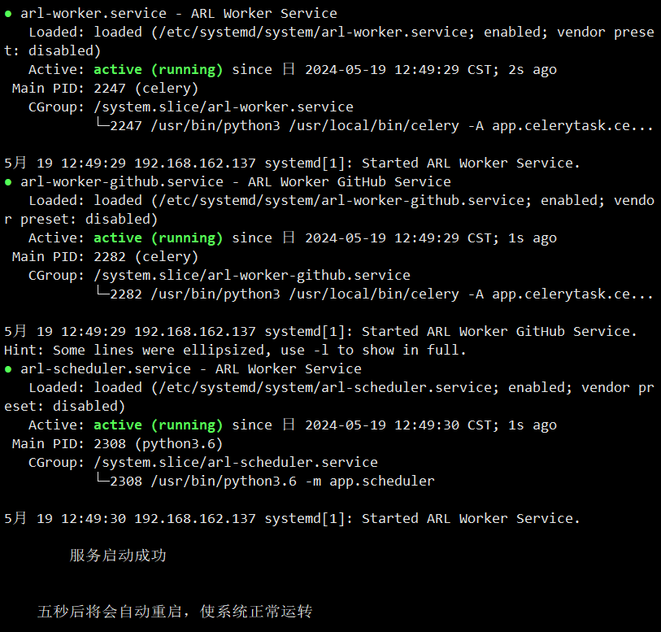
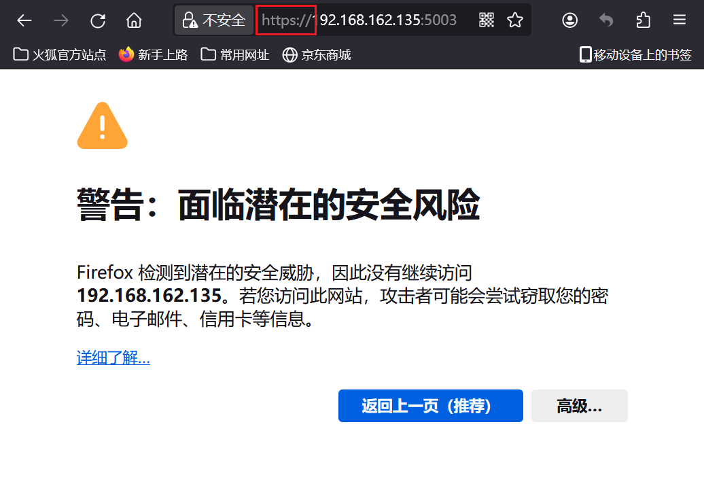
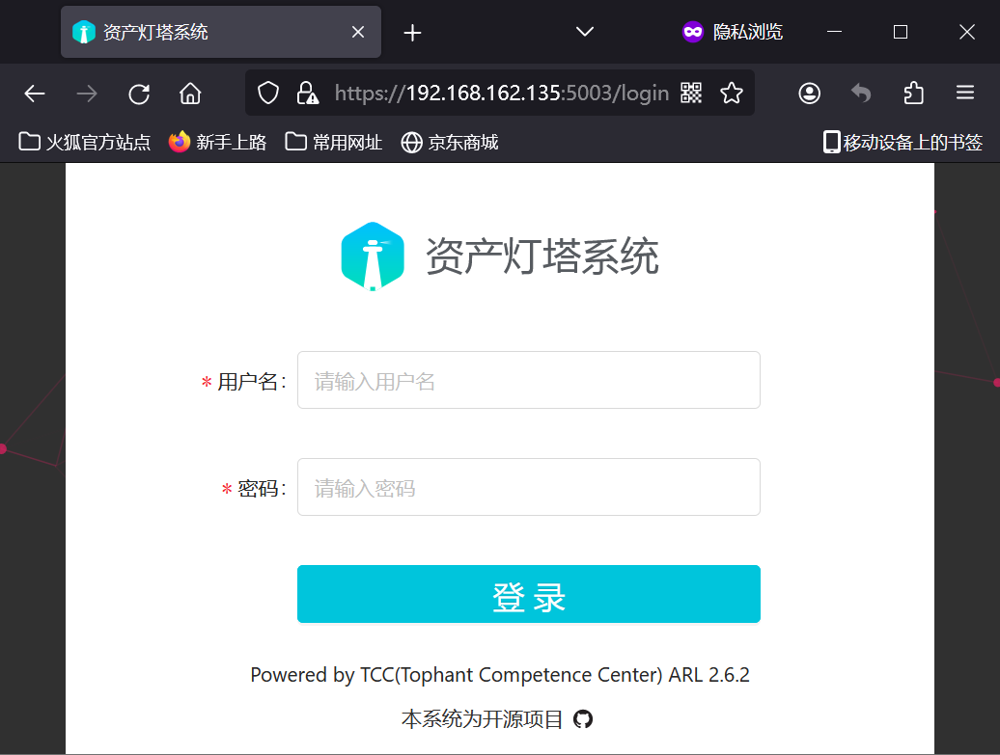

# 灯塔 2.6.2 本地安装

>支持系统：CentOS 7		[系统部署教程](https://blog.csdn.net/zatongtong/article/details/135666908)
>
>软件包下载地址：[GitHub.com](https://github.com/xiaolin8686/Linux_tools/releases/download/V1.0/ARL_toolkit.tar.gz)
>
>更新时间：2024-05-19
>
>**注意：该脚本原本就只测试了 CentOS 7，且该脚本未在云服务器上执行过，若在云服务器上执行安装脚本可能会出现未知 bug**

## 注明

&nbsp;&nbsp;&nbsp;&nbsp;灯塔 ARL 的官方开源项目被删除了，项目源地址 [ARL 灯塔系统](https://github.com/TophantTechnology/ARL)
&nbsp;&nbsp;&nbsp;&nbsp;灯塔 ARL 开源项目关闭原因：[跳转链接](https://mp.weixin.qq.com/s/hM3t3lYQVqDOlrLKz3_TSQ)
&nbsp;&nbsp;&nbsp;&nbsp;灯塔 ARL 官方使用文档：[使用文档](https://tophanttechnology.github.io/ARL-doc/)

## 软件组成

| 脚本/软件包        | 功能                                                         | MD5 校验值                       |
| ------------------ | ------------------------------------------------------------ | -------------------------------- |
| ARL_toolkit.tar.gz | ARL 总软件包，里面包含了安装所需的全部脚本和软件包           | 15e5e6b72f9f7566d78b2226431d3109 |
| main.sh            | 入口脚本，由 ARL 安装脚本 setup-arl.sh 改编而来              | 381ebfbdf9ba30b8430d80868928bb90 |
| init_env.sh        | 辅助脚本，主要系统环境部署，可单独执行(单独执行可用于验证系统环境是否部署成功) | aa72c0dc94a9afcf2b80b42c717b5488 |
| package.tar.gz     | ARL 系统环境软件包，里面包含了 ARL 系统目录以及所需软件包    | 2270f0058094a012c23a5b91961d3855 |

## 安装步骤

1. 将 ARL_toolkit.tar.gz 上传到服务器，目录随意。

   也可以通过命令 `wget https://github.com/xiaolin8686/Linux_tools/releases/download/V1.0/ARL_toolkit.tar.gz` 直接在服务器上下载

   该操作可能会出现服务器访问不到 GitHub 的情况，如果无法访问则需要开启代理，临时代理命令脚本 -> [Linux-proxy.sh](https://github.com/xiaolin8686/Linux_tools/blob/main/Proxy/Linux-proxy.sh)

2. 解压软件包

   ~~~bash
   tar -zxvf ARL_toolkit.tar.gz
   ~~~

   

3. （非必须）计算软件包/脚本的 md5 值，进行对比，确认软件包并未被更改

   ~~~bash
   find . -type f -print0 | xargs -0 md5sum
   ~~~

   

4. 执行自动化安装脚本（**注意：需要 root 权限，安装过程中 CentOS 7 系统需要全程连接网络，请保持网络连接稳定性**）

   ~~~bash
   sudo bash main.sh
   ~~~

   

   等待脚本运行 完毕，系统自动重启即可，如图

   

5. 登录系统 `https://IP:5003/` **协议是 https，http 可能访问不到系统**

   

   

   

6. 默认账户/密码：admin/arlpass

   

## 环境修复

> 当 main.sh 突然中断执行，可先执行 init_env.sh 进行环境验证，然后在执行 main.sh 继续部署灯塔

~~~bash
sudo bash init_env.sh
~~~

> 如果出现不存在，可先解压软件包 package.tar.gz 再继续执行脚本

~~~bash
tar -zxvf package.tar.gz && sudo bash init_env.sh
~~~

## 可能报错

> 由于在安装过程中，服务 `rabbitmq-server.service` 概率出现下列报错
>
> `job for rabbitmq-server.service failed because the control process exited with error code. see "systemctl status rabbitmq-server.service" and "journalctl -xe" for details`
>
> 经测试，对网卡进行 DNS 设置后重启虚拟机即可解决该问题

~~~bash
# 脚本如下

for i in /etc/sysconfig/network-scripts/ifcfg-*; do  
    if [[ "$i" != /etc/sysconfig/network-scripts/ifcfg-lo ]]; then  
        if [ -f "$i" ]; then  
			if grep -q 'DNS1=' $i; then
				echo "网卡 $i 已配置 DNS1'" 
			else  
				echo "$i 文件中不存在字符串'DNS1'" 
				echo "DNS1=8.8.8.8" >> $i
				echo "网卡 $i DNS1 添加完毕"
			fi

			if grep -q 'DNS2=' $i; then
				echo "网卡 $i 已配置 DNS2" 
			else  
				echo "$i 文件中不存在字符串'DNS2'" 
				echo "DNS2=8.8.4.4" >> $i
				echo "网卡 $i DNS2 添加完毕"
			fi
        fi  
    fi  
done
echo -e "\n    五秒后将会自动重启\n"
sleep 5
reboot
~~~

>由于在安装过程中，服务 `nginx.service` 概率出现下列报错
>
>`job for nginx.service failed because the control process exited with error code. see "systemctl status nginx.service" and "journalctl -xe" for details`
>
>经测试，关闭 SELinux 系统即可

~~~bash
# 临时关闭
setenforce 0

# 永久关闭
vi /etc/selinux/config

# 将参数 SELINUX 更改为 disabled
SELINUX=disabled

# 重启生效
reboot
~~~
