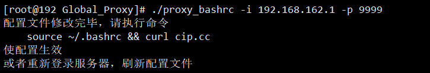
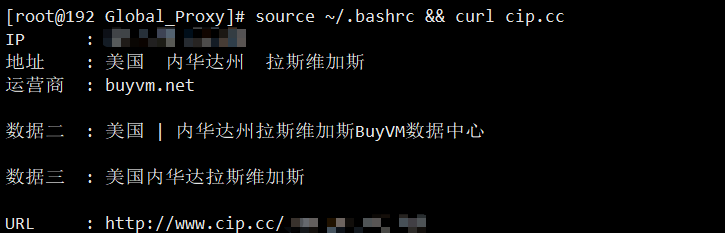
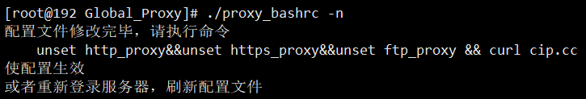
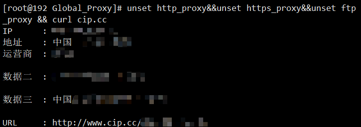
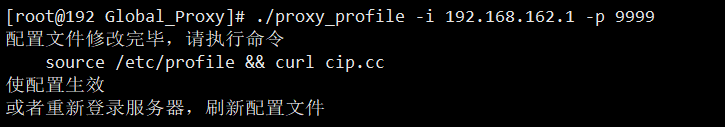
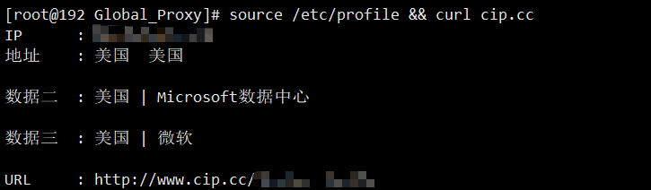
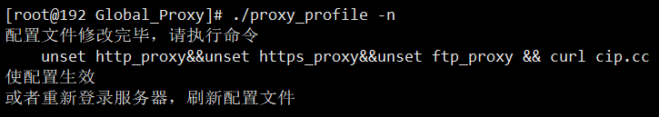
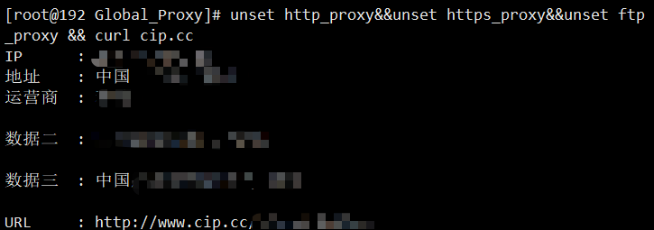

# proxy_bashrc

>@模块功能 : 全局代理小工具
>
>@开发环境 : Python3.10
>
>@开发平台 : Pycharm
>

## 工具介绍

&nbsp;&nbsp;&nbsp;&nbsp;Linux 全局代理小工具，通过操作 ~/.bashrc 文件，设置永久全局代理；

## 参数

~~~
usage: proxy_bashrc [-h] [-i] [-p] [-n]

Linux 全局代理小工具，通过操作 ~/.bashrc 文件，设置永久全局代理；
下载地址：https://github.com/xiaolin8686/Linux_tools/releases/

options:
  -h, --help    show this help message and exit
  -i , --ip     代理服务器 IP 地址
  -p , --port   代理服务器端口号
  -n, --false   独立参数，加入该参数将会取消全局代理
~~~

## 使用

### 开启永久全局代理

~~~bash
proxy_bashrc -i [IP地址] -p [端口号]
~~~

### 关闭永久全局代理

~~~bash
proxy_bashrc -n
~~~

****

# proxy_profile

>@模块功能 : 全局代理小工具
>
>@开发环境 : Python3.10
>
>@开发平台 : Pycharm

## 工具介绍

&nbsp;&nbsp;&nbsp;&nbsp;Linux 全局代理小工具，通过操作 /etc/profile 文件，设置永久全局代理；

## 参数

~~~
usage: proxy_profile [-h] [-i] [-p] [-n]

Linux 全局代理小工具，通过操作 /etc/profile 文件，设置永久全局代理；
下载地址：https://github.com/xiaolin8686/Linux_tools/releases/

options:
  -h, --help    show this help message and exit
  -i , --ip     代理服务器 IP 地址
  -p , --port   代理服务器端口号
  -n, --false   独立参数，加入该参数将会取消全局代理
~~~

## 使用

### 开启永久全局代理

~~~bash
proxy_profile -i [IP地址] -p [端口号]
~~~

### 关闭永久全局代理

~~~bash
proxy_profile -n
~~~

---

# proxy_kali

>@模块功能 : 全局代理小工具
>
>@开发环境 : Python3.10
>
>@开发平台 : Pycharm

## 工具介绍

&nbsp;&nbsp;&nbsp;&nbsp;Kali 全局代理小工具，通过操作 /etc/environment 文件，设置永久全局代理；

## 参数

~~~
usage: proxy_kali [-h] [-i] [-p] [-n] [-q]

Kali 全局代理小工具，通过操作 /etc/environment 文件，设置永久全局代理；
下载地址：https://github.com/xiaolin8686/Linux_tools/releases/

options:
  -h, --help        show this help message and exit
  -i , --ip         代理服务器 IP 地址
  -p , --port       代理服务器端口号
  -n, --no          关闭全局代理设置
  -q, --QueryProxy  查看系统代理设置
~~~

## 使用

### 开启永久全局代理

~~~bash
proxy_kali -i [IP地址] -p [端口号]
~~~

### 关闭永久全局代理

~~~bash
proxy_kali -n
~~~

### 查看系统代理

~~~bash
proxy_kali -q
~~~

#### 未设置系统代理图

#### 已设置系统代理图

